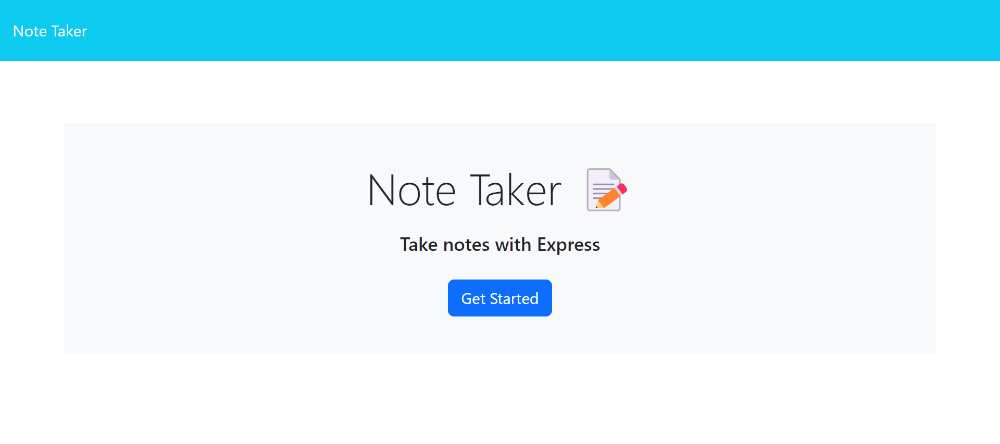
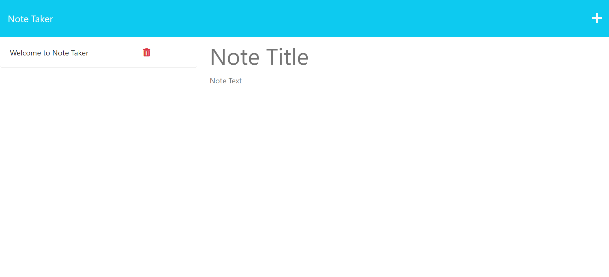

# Challenge 9 Note Taker

## Description

This project was created so as to learn how express, npm, and heroku work and to create a note web application. This was done so that a understanding of express heroku and node would be learned. Through this, I have gained a better understanding of the backend development and how it can be used to create an app.

## Installation
```
npm init
npm i express
npm i uuid
```
## Screenshot




## Portfolio

[Link to gethub](https://github.com/Solomon-Coding/challenge9-noteTaker)

## Portfolio

[Link to webpage](https://radiant-garden-51312.herokuapp.com/)

## Credits
N/A

## License

None